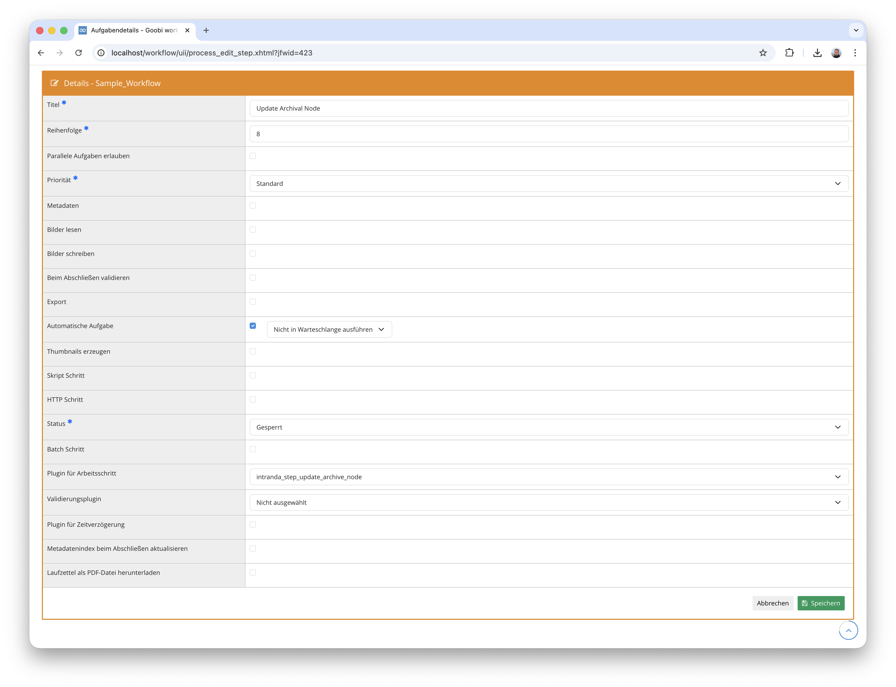

## Einführung
Die vorliegende Dokumentation beschreibt die Installation, Konfiguration und den Einsatz des Plugins für die automatische Erstellung und Aktualisierung von Archivknoten. Das Plugin ermöglicht es, aus den Metadaten eines Goobi-Vorgangs heraus Knoten in einer EAD-Tektonik zu erstellen oder bestehende Knoten zu aktualisieren. Dabei werden die Metadaten aus der METS-Datei des Vorgangs in die Felder des Archivknotens übertragen. Das Plugin unterstützt drei verschiedene Modi zur Bestimmung des Elternknotens: feste Konfiguration, Auslesen aus einem Metadatenfeld oder automatischer Aufbau einer Hierarchie.


## Installation
Zur Nutzung des Plugins müssen die folgenden Dateien installiert werden:

```bash
/opt/digiverso/goobi/plugins/step/plugin-step-update-archive-node-base.jar
/opt/digiverso/goobi/plugins/GUI/plugin-step-update-archive-node-lib.jar
```

Die Konfiguration des Plugins wird unter folgendem Pfad erwartet:

```bash
/opt/digiverso/goobi/config/plugin_intranda_step_update_archive_node.xml
```

Dieses Plugin setzt außerdem voraus, dass das folgende Plugin installiert ist:

- `plugin-administration-archive-management`


## Überblick und Funktionsweise
Nachdem das Plugin installiert und konfiguriert wurde, kann es in einem Workflowschritt als automatische Aufgabe eingebunden werden. Hierbei sollte darauf geachtet werden, dass der Schritt als `Automatische Aufgabe` markiert ist.



Das Plugin führt bei der Ausführung folgende Schritte durch:

- Die METS-Datei des aktuellen Vorgangs wird geöffnet und die Metadaten der logischen Dokumentstruktur gelesen.
- Es wird geprüft, ob im Vorgang bereits ein Identifikator-Metadatum vorhanden ist, das auf einen bestehenden Archivknoten verweist.
- Falls ein Identifikator vorhanden ist, wird der zugehörige Archivknoten gesucht und seine Metadaten aktualisiert. Nur bei tatsächlichen Änderungen wird der Knoten gespeichert.
- Falls kein Identifikator vorhanden ist, wird je nach konfiguriertem Modus ein neuer Archivknoten erstellt und die Metadaten aus dem Vorgang übertragen.
- Der Identifikator des neuen oder aktualisierten Knotens wird als Metadatum im Vorgang gespeichert, um bei erneuter Ausführung den Knoten wiederzufinden.


## Konfiguration
Die Konfiguration des Plugins erfolgt in der Datei `plugin_intranda_step_update_archive_node.xml` wie hier aufgezeigt:

{{CONFIG_CONTENT}}

{{CONFIG_DESCRIPTION_PROJECT_STEP}}

Parameter                  | Erläuterung
---------------------------|------------------------------------
`identifierMetadataField`  | Name des Metadatenfeldes in der METS-Datei des Vorgangs, das den Identifikator des Archivknotens enthält. Über dieses Feld wird bei erneuter Ausführung der zugehörige Knoten wiedergefunden.
`identifierNodeField`      | Name des Feldes im Archivknoten, das als Identifikator dient (z.B. `reference code`).
`nodeTypeBranch`           | Knotentyp für Verzweigungsknoten. Standardwert: `folder`. Wird im Modus `hierarchy` für Zwischenknoten verwendet.
`nodeTypeLeaf`             | Knotentyp für Blattknoten. Standardwert: `file`. Wird für den endgültigen Knoten verwendet, der die Vorgangsmetadaten enthält.
`archive`                  | Name des Archivs in der Archivverwaltung, in dem die Knoten erstellt oder aktualisiert werden sollen.
`parentType`               | Modus zur Bestimmung des Elternknotens. Mögliche Werte: `fixed`, `metadata` oder `hierarchy`. Details siehe unten.
`parentNodeId`             | ID des Elternknotens für den Modus `fixed`. Kann mit dem Attribut `doctype` pro Dokumenttyp separat konfiguriert werden.
`defaultParentNodeId`      | Standard-Elternknoten-ID für den Modus `fixed`, falls für den aktuellen Dokumenttyp kein spezifischer Elternknoten konfiguriert ist.
`parentNodeMetadataName`   | Name des Metadatenfeldes in der METS-Datei, das die ID des Elternknotens enthält. Wird nur im Modus `metadata` verwendet.
`hierarchyMetadataName`    | Name des Metadatenfeldes, dessen Wert zur Erzeugung einer Hierarchie aufgesplittet wird. Wird nur im Modus `hierarchy` verwendet. Das Attribut `split` legt das Trennzeichen fest.


## Modi zur Bestimmung des Elternknotens
Das Plugin unterstützt drei verschiedene Modi, die über den Parameter `parentType` gesteuert werden.

### Modus `fixed` - Fester Elternknoten
In diesem Modus wird der Elternknoten über eine fest konfigurierte ID bestimmt. Der Elternknoten kann dabei pro Dokumenttyp unterschiedlich definiert werden:

```xml
<parentType>fixed</parentType>
<parentNodeId doctype="Monograph">parent_id_123</parentNodeId>
<parentNodeId doctype="Manuscript">parent_id_456</parentNodeId>
<defaultParentNodeId>default_parent_id</defaultParentNodeId>
```

Das Plugin sucht zuerst nach einem `parentNodeId`-Element, dessen `doctype`-Attribut dem Dokumenttyp des aktuellen Vorgangs entspricht. Wird kein passendes Element gefunden, wird der in `defaultParentNodeId` konfigurierte Standardwert verwendet. Unterhalb des so ermittelten Elternknotens wird ein neuer Blattknoten erstellt.

### Modus `metadata` - Elternknoten aus Metadatum
In diesem Modus wird die ID des Elternknotens aus einem Metadatenfeld der METS-Datei gelesen:

```xml
<parentType>metadata</parentType>
<parentNodeMetadataName>ParentNodeId</parentNodeMetadataName>
```

Das Plugin liest den Wert des konfigurierten Metadatenfeldes und sucht den zugehörigen Knoten im Archiv. Unterhalb dieses Knotens wird ein neuer Blattknoten erstellt. Falls das Metadatenfeld nicht vorhanden ist, wird die Ausführung mit einem Fehler abgebrochen.

### Modus `hierarchy` - Automatischer Hierarchieaufbau
In diesem Modus wird aus einem Metadatenwert automatisch eine Knotenhierarchie aufgebaut:

```xml
<parentType>hierarchy</parentType>
<hierarchyMetadataName split="_">ClassificationPath</hierarchyMetadataName>
```

Der Metadatenwert wird anhand des konfigurierten Trennzeichens (`split`-Attribut) in einzelne Bestandteile zerlegt. Aus diesen Bestandteilen wird schrittweise eine Hierarchie aufgebaut.

**Beispiel:** Der Wert `CR_1_C_St_30` mit dem Trennzeichen `_` erzeugt folgende Hierarchie:

| Ebene | Identifikator | Knotentyp |
| :--- | :--- | :--- |
| 1 | `CR` | Verzweigungsknoten (`folder`) |
| 2 | `CR_1` | Verzweigungsknoten (`folder`) |
| 3 | `CR_1_C` | Verzweigungsknoten (`folder`) |
| 4 | `CR_1_C_St` | Verzweigungsknoten (`folder`) |
| 5 | `CR_1_C_St_30` | Blattknoten (`file`) |

Für jeden Bestandteil wird geprüft, ob der zugehörige Knoten bereits existiert. Falls ja, wird dieser als Elternknoten für die nächste Ebene verwendet. Falls nein, wird ein neuer Knoten erstellt. Zwischenknoten erhalten den Knotentyp `folder` (Verzweigung), nur der letzte Knoten erhält den Typ `file` (Blatt) und wird mit den Metadaten des Vorgangs befüllt.

Die Sortierung neuer Knoten innerhalb des Elternknotens wird dabei wie folgt bestimmt: Ist der aktuelle Bestandteil numerisch, wird er als Positionsnummer verwendet. Andernfalls wird der Knoten am Ende der bestehenden Kindknoten eingefügt.


## Aktualisierung bestehender Knoten
Wenn in den Metadaten des Vorgangs bereits ein Identifikator (konfiguriert über `identifierMetadataField`) vorhanden ist, versucht das Plugin zunächst, den zugehörigen Archivknoten zu finden und zu aktualisieren.

Bei der Aktualisierung wird vor und nach dem Import der Metadaten ein Fingerprint des Knotens berechnet. Nur wenn sich die Metadaten tatsächlich geändert haben, wird der Knoten gespeichert. Dadurch werden unnötige Schreibvorgänge vermieden.

Falls der referenzierte Knoten nicht mehr existiert, wird stattdessen wie bei einer Neuanlage verfahren.


## Metadaten-Import
Beim Import von Metadaten aus dem Vorgang in den Archivknoten werden alle in der Archivkonfiguration definierten Bereiche berücksichtigt:

- Identity Statement Area (Identifikationsbereich)
- Context Area (Kontextbereich)
- Content and Structure Area (Inhalts- und Strukturbereich)
- Access and Use Area (Zugangs- und Nutzungsbereich)
- Allied Materials Area (Verwandte Materialien)
- Notes Area (Bemerkungen)
- Description Control Area (Beschreibungskontrolle)

Folgende Metadatentypen werden unterstützt:

- **Einfache Metadaten**: Textwerte und Normdatenverknüpfungen
- **Personen**: Vorname, Nachname und Normdatenverknüpfung
- **Körperschaften**: Hauptname, Unterordnung, Teilbezeichnung und Normdatenverknüpfung
- **Metadatengruppen**: Komplexe Strukturen mit mehreren Unterfeldern

Das Mapping zwischen den Metadatenfeldern des Vorgangs und den Feldern des Archivknotens wird über die Konfiguration der Archivverwaltung (`plugin-administration-archive-management`) gesteuert.
