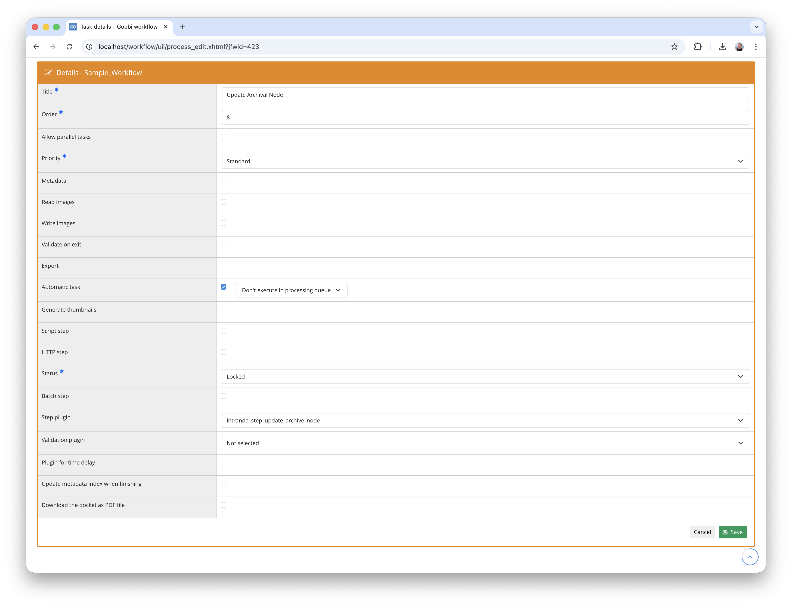

## Introduction
This documentation describes the installation, configuration and use of the plugin for automatically creating and updating archive nodes. The plugin makes it possible to create nodes in an EAD hierarchy or update existing nodes based on the metadata of a Goobi process. The metadata from the METS file of the process is transferred into the fields of the archive node. The plugin supports three different modes for determining the parent node: fixed configuration, reading from a metadata field, or automatic hierarchy building.


## Installation
To use the plugin, the following files must be installed:

```bash
/opt/digiverso/goobi/plugins/step/plugin-step-update-archive-node-base.jar
/opt/digiverso/goobi/plugins/GUI/plugin-step-update-archive-node-lib.jar
```

The plugin configuration is expected at the following path:

```bash
/opt/digiverso/goobi/config/plugin_intranda_step_update_archive_node.xml
```

This plugin also requires the following plugin to be installed:

- `plugin-administration-archive-management`


## Overview and functionality
Once the plugin has been installed and configured, it can be integrated into a workflow step as an automatic task. The step should be marked as `Automatic task`.



When executed, the plugin performs the following steps:

- The METS file of the current process is opened and the metadata of the logical document structure is read.
- It checks whether the process already contains an identifier metadata field that references an existing archive node.
- If an identifier is present, the corresponding archive node is located and its metadata is updated. The node is only saved if actual changes have been made.
- If no identifier is present, a new archive node is created depending on the configured mode, and the metadata is transferred from the process.
- The identifier of the new or updated node is saved as metadata in the process so that the node can be found again during subsequent executions.


## Configuration
The plugin is configured in the file `plugin_intranda_step_update_archive_node.xml` as shown here:

{{CONFIG_CONTENT}}

{{CONFIG_DESCRIPTION_PROJECT_STEP}}

Parameter                  | Explanation
---------------------------|------------------------------------
`identifierMetadataField`  | Name of the metadata field in the METS file of the process that contains the archive node identifier. This field is used to find the associated node during subsequent executions.
`identifierNodeField`      | Name of the field in the archive node that serves as identifier (e.g. `reference code`).
`nodeTypeBranch`           | Node type for branch nodes. Default: `folder`. Used in `hierarchy` mode for intermediate nodes.
`nodeTypeLeaf`             | Node type for leaf nodes. Default: `file`. Used for the final node that contains the process metadata.
`archive`                  | Name of the archive in the archive management in which nodes should be created or updated.
`parentType`               | Mode for determining the parent node. Possible values: `fixed`, `metadata` or `hierarchy`. See details below.
`parentNodeId`             | ID of the parent node for `fixed` mode. Can be configured per document type using the `doctype` attribute.
`defaultParentNodeId`      | Default parent node ID for `fixed` mode, used when no specific parent node is configured for the current document type.
`parentNodeMetadataName`   | Name of the metadata field in the METS file that contains the parent node ID. Only used in `metadata` mode.
`hierarchyMetadataName`    | Name of the metadata field whose value is split to create a hierarchy. Only used in `hierarchy` mode. The `split` attribute specifies the separator character.


## Modes for determining the parent node
The plugin supports three different modes, controlled via the `parentType` parameter.

### Mode `fixed` - Fixed parent node
In this mode, the parent node is determined via a statically configured ID. The parent node can be defined differently per document type:

```xml
<parentType>fixed</parentType>
<parentNodeId doctype="Monograph">parent_id_123</parentNodeId>
<parentNodeId doctype="Manuscript">parent_id_456</parentNodeId>
<defaultParentNodeId>default_parent_id</defaultParentNodeId>
```

The plugin first searches for a `parentNodeId` element whose `doctype` attribute matches the document type of the current process. If no matching element is found, the default value configured in `defaultParentNodeId` is used. A new leaf node is created below the determined parent node.

### Mode `metadata` - Parent node from metadata
In this mode, the parent node ID is read from a metadata field in the METS file:

```xml
<parentType>metadata</parentType>
<parentNodeMetadataName>ParentNodeId</parentNodeMetadataName>
```

The plugin reads the value of the configured metadata field and searches for the corresponding node in the archive. A new leaf node is created below this node. If the metadata field is not present, execution is aborted with an error.

### Mode `hierarchy` - Automatic hierarchy building
In this mode, a node hierarchy is automatically built from a metadata value:

```xml
<parentType>hierarchy</parentType>
<hierarchyMetadataName split="_">ClassificationPath</hierarchyMetadataName>
```

The metadata value is split into individual components using the configured separator character (`split` attribute). A hierarchy is then built step by step from these components.

**Example:** The value `CR_1_C_St_30` with the separator `_` creates the following hierarchy:

| Level | Identifier | Node type |
| :--- | :--- | :--- |
| 1 | `CR` | Branch node (`folder`) |
| 2 | `CR_1` | Branch node (`folder`) |
| 3 | `CR_1_C` | Branch node (`folder`) |
| 4 | `CR_1_C_St` | Branch node (`folder`) |
| 5 | `CR_1_C_St_30` | Leaf node (`file`) |

For each component, the plugin checks whether the corresponding node already exists. If so, it is used as the parent for the next level. If not, a new node is created. Intermediate nodes are assigned the `folder` (branch) node type, and only the final node receives the `file` (leaf) type and is populated with the process metadata.

The sort order of new nodes within the parent is determined as follows: if the current component is numeric, it is used as the position number. Otherwise, the node is appended at the end of the existing child nodes.


## Updating existing nodes
If the process metadata already contains an identifier (configured via `identifierMetadataField`), the plugin first attempts to find and update the corresponding archive node.

During the update, a fingerprint of the node is calculated before and after importing the metadata. The node is only saved if the metadata has actually changed. This prevents unnecessary write operations.

If the referenced node no longer exists, the plugin proceeds with creating a new node instead.


## Metadata import
When importing metadata from the process into the archive node, all areas defined in the archive configuration are considered:

- Identity Statement Area
- Context Area
- Content and Structure Area
- Access and Use Area
- Allied Materials Area
- Notes Area
- Description Control Area

The following metadata types are supported:

- **Simple metadata**: Text values and authority data links
- **Persons**: First name, last name and authority data link
- **Corporates**: Main name, subordinate unit, part name and authority data link
- **Metadata groups**: Complex structures with multiple sub-fields

The mapping between the metadata fields of the process and the fields of the archive node is controlled via the configuration of the archive management (`plugin-administration-archive-management`).
